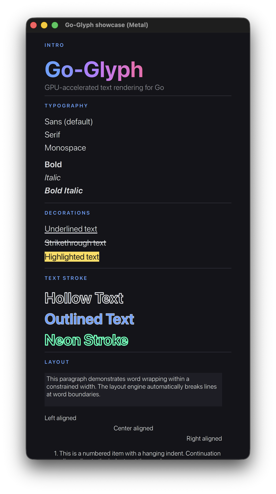

# Go-Glyph


[](https://deepwiki.com/mike-ward/go-glyph)

High-performance text rendering for Go. Shaping, layout, rasterization, and
editing. Text shaping and rasterization are pure Go on all platforms — no C
libraries or system text APIs are required for the core library.

| OS      | Shaper             | Rasterizer     |
| ------- | ------------------ | -------------- |
| Linux   | HarfBuzz (go-text) | x/image/vector |
| macOS   | HarfBuzz (go-text) | x/image/vector |
| iOS     | HarfBuzz (go-text) | x/image/vector |
| Windows | HarfBuzz (go-text) | x/image/vector |
| Android | HarfBuzz (go-text) | x/image/vector |
| WASM    | Canvas2D           | Canvas2D       |

The `glyph` package builds with `CGO_ENABLED=0` on all platforms. CGo is only
used by the optional GPU rendering backends (`backend/gpu`, `backend/ios`,
`backend/android`) to reach native graphics APIs (Metal, OpenGL, GLES).



## Prerequisites

| Platform     | Requirements                                                                                                                               |
| ------------ | ------------------------------------------------------------------------------------------------------------------------------------------ |
| All          | None — the `glyph` package is cgo-free and has zero system dependencies.                                                                   |
| GPU backends | CGo + platform SDK (Xcode for Metal, GL/GLES dev libraries). Not needed unless you use `backend/gpu`, `backend/ios`, or `backend/android`. |

## Install

```sh
go get github.com/go-gui-org/go-glyph@latest
```

## Quick Start

```go
ts, err := glyph.NewTextSystem(backend)
if err != nil {
    log.Fatal(err)
}
defer ts.Free()

ts.DrawText(x, y, "Hello, World!", glyph.TextConfig{
    Style: glyph.TextStyle{FontName: "Sans 24", Color: glyph.Color{A: 255}},
})
ts.Commit()
```

See [package docs](https://pkg.go.dev/github.com/go-gui-org/go-glyph) for the
full API — text styling, layout queries, rich text, transforms, text mutation,
IME, and accessibility.

## License

See [LICENSE](LICENSE).
