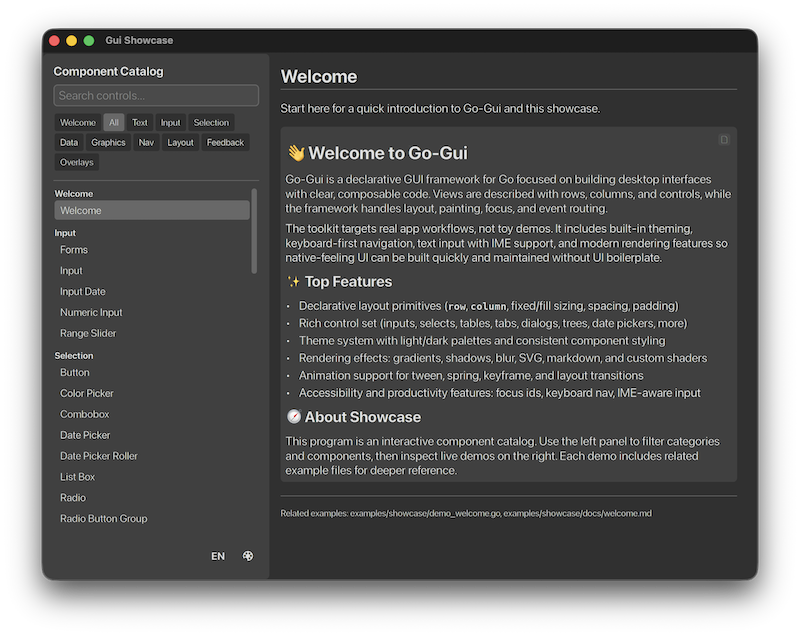
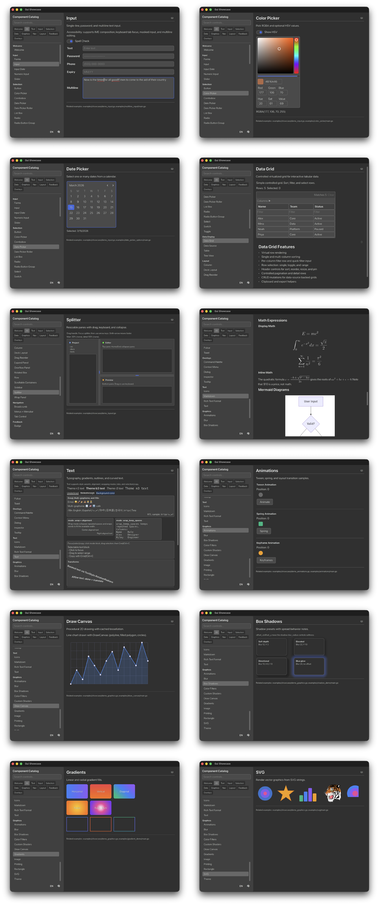
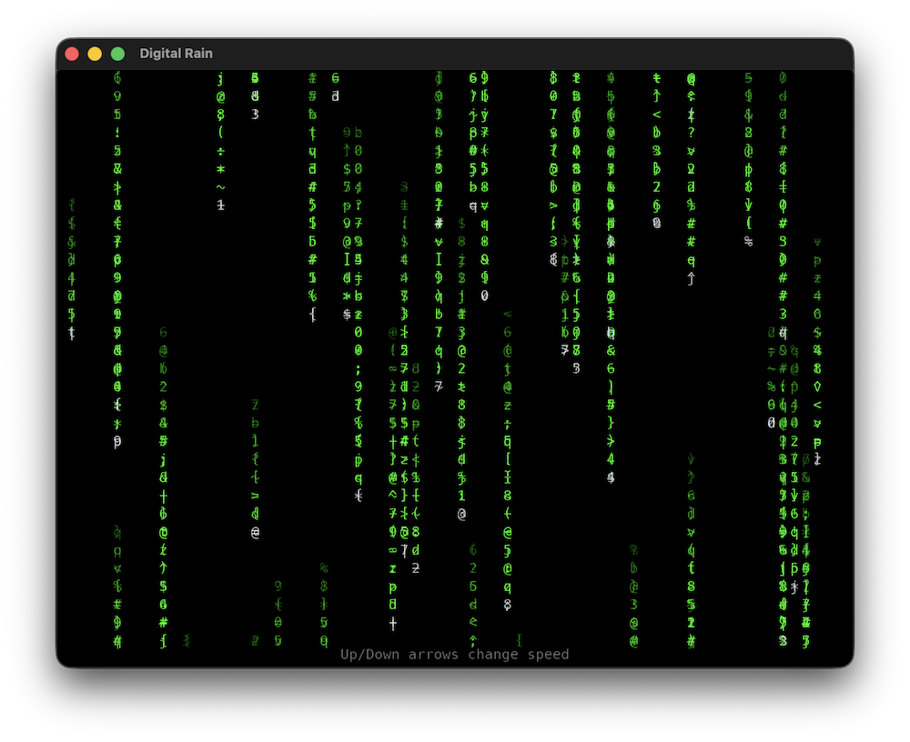

# Go-Gui


[](https://deepwiki.com/go-gui-org/go-gui)
[](https://github.com/go-gui-org/go-gui/wiki)

**A modern GUI framework for Go.**

**Build modern, cross-platform applications entirely in Go — no browser runtime,
no JavaScript, HTML, or CSS.**

Write your UI entirely in Go. Your data stays in Go structs. Your UI stays in Go
code. Render with native GPU acceleration — Metal on macOS, cgo-free OpenGL on
Linux and Windows, and WebGL/WASM in the browser.

https://go-gui.com · [Documentation](https://github.com/go-gui-org/go-gui/wiki)
· [Showcase](https://go-gui-org.github.io/showcase/)

---

## Showcase



Explore the widgets, layouts, animation, text rendering, and other capabilities
interactively. Every demo includes built-in documentation.

**[Open the Showcase →](https://go-gui-org.github.io/showcase/)** _Zero install.
Instant evaluation._

---

## It's just Go

Your UI is Go code. Your state is Go data. Your application is a Go program.

```go
package main

import (
    "fmt"

    "github.com/go-gui-org/go-gui/gui"
    "github.com/go-gui-org/go-gui/gui/backend"
)

type App struct{ Clicks int }

func main() {
    w := gui.SimpleWindow("Counter", 300, 150, &App{}, func(w *gui.Window) {
        w.SetView(mainView)
    })

    backend.Run(w)
}

func mainView(w *gui.Window) gui.View {
    app := gui.State[App](w)

    return gui.Column(gui.ContainerCfg{
        Content: []gui.View{
            gui.Label(fmt.Sprintf("%d Clicks", app.Clicks), gui.TextStyle{}),
            gui.TextButton("counter", "Click Me", func(ctx gui.EventCtx) {
                gui.State[App](ctx.Window).Clicks++
            }),
        },
    })
}
```

`gui.Label(text, style)` uses the default theme style with `TextStyle{}`.
`gui.TextButton(id, label, onClick)` and `gui.SimpleWindow` are thin convenience
forms. The `ID` argument stays explicit because identity is caller-owned.

See [`examples/get_started/`](examples/get_started/) for the full runnable
version and [`examples/web_demo/`](examples/web_demo/) for the browser build.

Guides: [Debugging](https://github.com/go-gui-org/go-gui/wiki/Debugging) ·
[Theming](https://github.com/go-gui-org/go-gui/wiki/Theming) ·
[Testing](https://github.com/go-gui-org/go-gui/wiki/Testing)

---

## What it can do

Go-Gui takes a different approach: a pure-Go UI with native GPU rendering. There
is no browser runtime, JavaScript bridge, or web stack underneath your
application.

Go-Gui is also an ecosystem of composable libraries. **go-glyph** handles text,
**go-charts** handles data visualization, and **go-edit** provides code editing
— each usable independently or together.

- **50+ widgets** — buttons, inputs, sliders, tables, trees, tabs, menus,
  dialogs, toasts, DataGrid with CSV/XLSX/PDF export, Markdown and RTF views,
  SVG rendering, and more
- **Virtualized data** — `ListBox`, `Table`, and `Tree` virtualize rows they
  own. `VirtualList` handles rows the app builds, including rows whose height is
  known only during layout. `Window.ScrollToIndex` can address a row that does
  not exist yet
- **GPU-accelerated rendering** — Metal on macOS, OpenGL on Linux and Windows,
  WebGL/WASM in the browser, and Metal/UIKit on iOS
- **Rich interaction** — keyframe, spring, and tween animation, hero
  transitions, gestures, scrolling, focus management, color filters, box
  shadows, and blur effects
- **Professional text & accessibility** — text shaping, rendering, bidirectional
  layout, font fallback, IME, spell checking, and full accessibility support
- **Native application integration** — file dialogs, menus, notifications,
  printing, PDF, system tray, frameless windows, and other platform services
- **Developer tools** — time-travel debugging, headless testing, headless
  rendering, layout inspection, and pixel-level regression testing



### Go-Gui ecosystem

Build on a collection of composable Go libraries that share the same rendering
pipeline and event system.

- **go-charts** — Interactive chart widgets.
  https://github.com/go-gui-org/go-charts
- **go-edit** — Code editor widget. https://github.com/go-gui-org/go-edit
- **go-map** — SMIL map widgets. https://github.com/go-gui-org/go-map
- **go-term** — Embeddable terminal emulator.
  https://github.com/go-gui-org/go-term
- **go-glyph** — Text rendering engine. https://github.com/go-gui-org/go-glyph

### Example applications

- **go-kite** — Desktop Bluesky client. https://github.com/go-gui-org/go-kite

---

## Under the Hood

Hybrid immediate-mode UI with a retained widget tree. No virtual DOM, no diffing
— each frame rebuilds the UI from your view function, then the framework handles
layout, rendering, input, and state persistence.

```text
View fn → generateViewLayout() → Layout tree
  → layoutArrange() (Fit/Fixed/Fill sizing)
  → renderLayout() (emits into w.renderers)
  → Backend (Metal on macOS; native GL on Linux/Windows; WebGL/WASM on web)
```

One typed state slot per window (`gui.State[T](w)`), plus per-widget internal
state via `StateMap`. See [`docs/architecture.md`](docs/architecture.md) for the
full pipeline, event dispatch, and backend layer.

### Full control

Every convenience form forwards to the matching `Cfg` struct. Use it when you
need the knobs — fonts, colors, sizing, padding, events:

```go
w := gui.NewWindow(gui.WindowCfg{
    State:     &App{},
    Title:     "Counter",
    Width:     300,
    Height:    150,
    MinWidth:  200, // the OS stops the resize drag here
    MinHeight: 120,
    OnInit:    func(w *gui.Window) { w.SetView(mainView) },
})

gui.Button(gui.ButtonCfg{
    ID:      "counter",
    Content: []gui.View{gui.Text(gui.TextCfg{Text: "Click Me"})},
    Padding: gui.NewPadding(8, 16, 8, 16),
    OnClick: func(ctx gui.EventCtx) {
        gui.State[App](ctx.Window).Clicks++
    },
})
```

---

## Installation

Requires **Go 1.26+**. A **C toolchain** (CGo) is needed only on **macOS** — the
Metal backend is Objective-C. Linux and Windows build fully cgo-free
(`CGO_ENABLED=0 go build ./...`). The desktop backends are native: Metal on
macOS, X11 + EGL on Linux, Win32 + WGL on Windows. Text shaping and
rasterization are pure Go via go-glyph.

```bash
go get github.com/go-gui-org/go-gui
```

See the
[Installation Guide](https://github.com/go-gui-org/go-gui/wiki/Installation) for
platform-specific instructions.

### Showcase downloads

| Platform       | Download                                                                                       |
| -------------- | ---------------------------------------------------------------------------------------------- |
| Browser (WASM) | [**Open Showcase**](https://go-gui-org.github.io/showcase/) — zero install, instant evaluation |
| macOS          | [Go-Gui-Showcase-<version>.dmg](https://github.com/go-gui-org/go-gui/releases)                 |
| Linux          | [go-gui-showcase-<version>-linux-amd64.tar.gz](https://github.com/go-gui-org/go-gui/releases)  |
| Windows        | [go-gui-showcase-<version>-windows-amd64.zip](https://github.com/go-gui-org/go-gui/releases)   |

See [Deploying your app](docs/deployment.md) to ship your own `.app`/`.dmg`,
icon-embedded `.exe`, or menu-installable Linux tarball.

---

## Contributing

1. Install **Go 1.26+** (a C toolchain too if developing on macOS; see
   [Installation](#installation)).
2. Clone the repo.
3. Run tests and lint:

```bash
go test ./...
go vet ./...
make lint
```

4. Open a pull request with a clear description of the change.

---



## Roadmap

Planning lives in [GitHub Issues](../../issues) and the go-gui-org project
board, not a checked-in roadmap file. Browse open issues for current and planned
work.

---

## Debugging

Set `GOGUI_DEBUG=1` (or `gui.Debug(true)`) to audit every frame for duplicate
widget IDs and focusable widgets without IDs. `gui.DebugCategories` enables each
class of finding — duplicates, missing IDs, unconsumed events, listbox
virtualization, over-stop gradients, unresolved state keys, unclaimed focus IDs,
stamp drift, dropped callbacks and links, refused window features —
independently. See the
[Debugging](https://github.com/go-gui-org/go-gui/wiki/Debugging) wiki page.

## License

[MIT](LICENSE)
