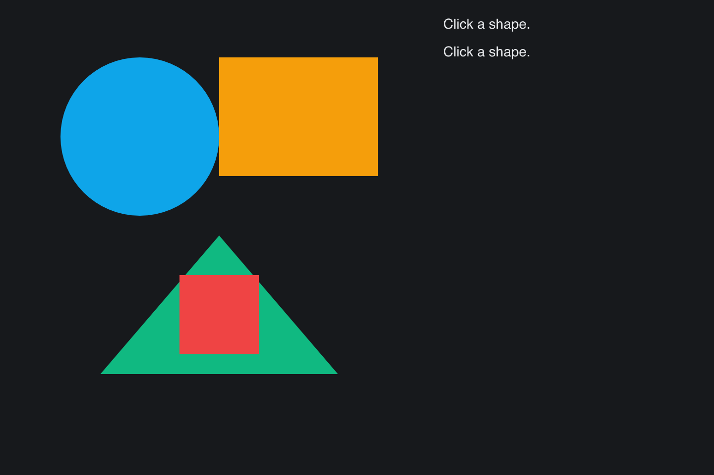

# SVG Hittest

> **Framework:** svg, input **Description:** Hit testing with
> TessellatedPath.ContainsPoint. Reports which authored path the cursor is
> inside.



<!-- explorer: tags=svg,input category=svg run=go -->

---

# svg_hittest

Click any shape in the rendered SVG. The right pane prints the matched `PathID`
and viewBox coordinates. Demonstrates `TessellatedPath.ContainsPoint` with the
typical "display→viewBox" coord conversion (divide by `cached.Scale`, add
viewBox origin).

## Run

```
go run ./examples/svg_hittest
```

Click in the empty space between shapes to see the empty-cell readout. Click on
a circle/rect/triangle to see its PathID. Note that `ContainsPoint` ignores
stroke paths — fill triangulation is the hit target.
