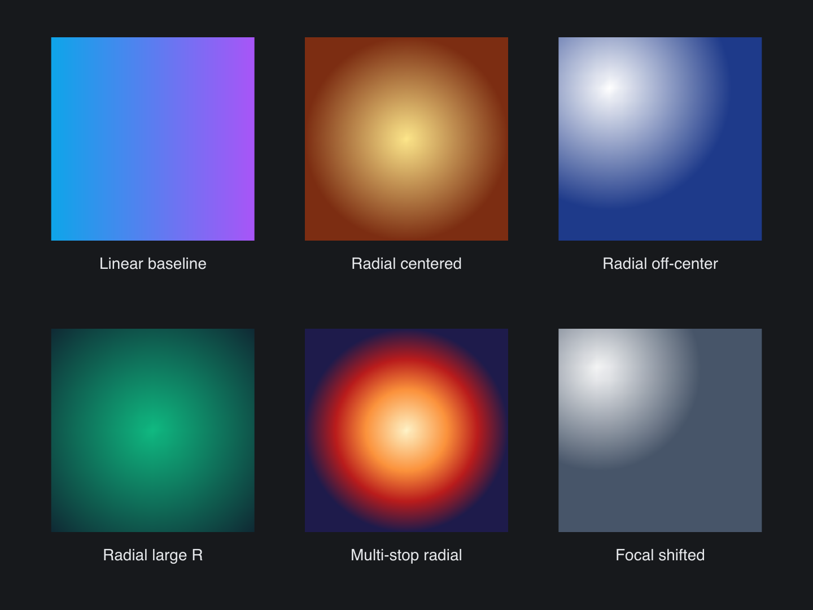

# SVG Radial

> **Framework:** svg **Description:** Radial gradient parsing and rendering
> across six configurations. Shows focal and radius variation.



<!-- explorer: tags=svg category=svg run=go -->

---

# svg_radial

Six tiles render the same 100x100 box with linear, centered radial, off-center
radial, large-R radial, multi-stop radial, and a shifted-focal radial gradient.
This confirms the new `<radialGradient>` parsing and render path.

## Run

```
go run ./examples/svg_radial
```
