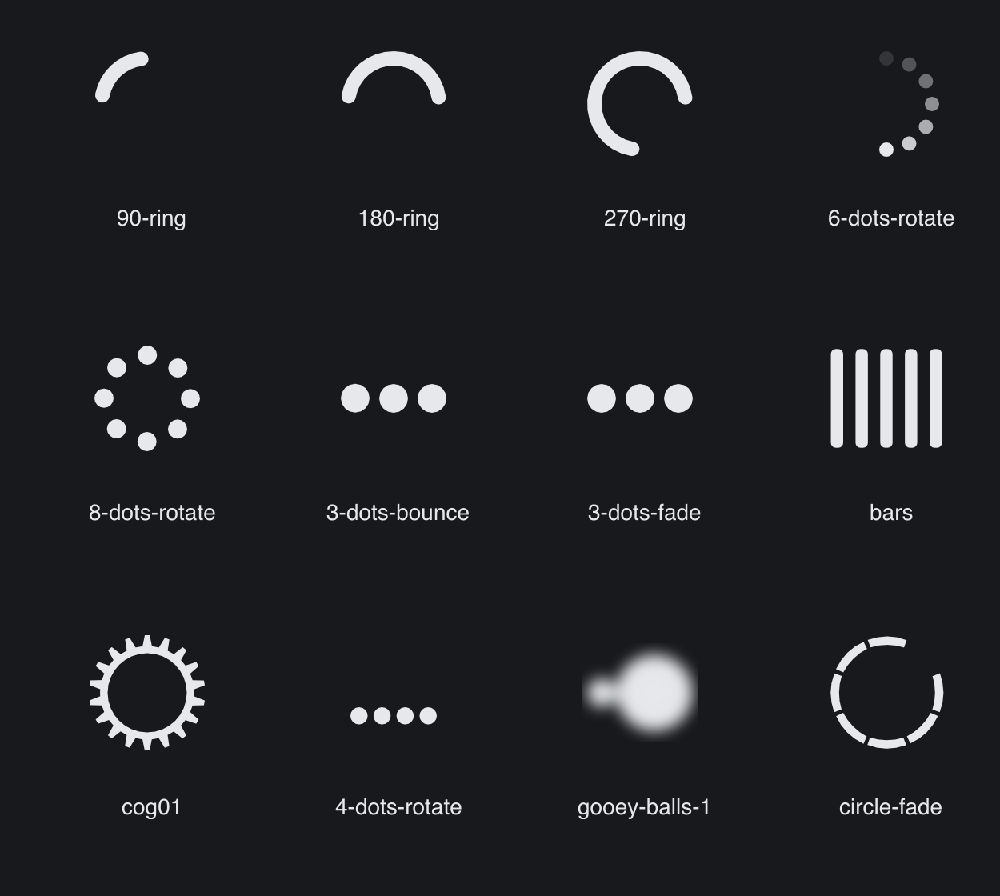

# SVG Spinners

> **Framework:** svg, animation **Description:** Curated subset of built-in
> SvgSpinner kinds. Shows SMIL and CSS keyframe techniques across families.



<!-- explorer: tags=svg,animation category=svg run=go -->

---

## Run

```sh
go run ./examples/svg_spinners/
```

## What it demonstrates

Curated subset of built-in SvgSpinner kinds. Shows SMIL and CSS keyframe
techniques across families.

See `main.go` for the implementation.
