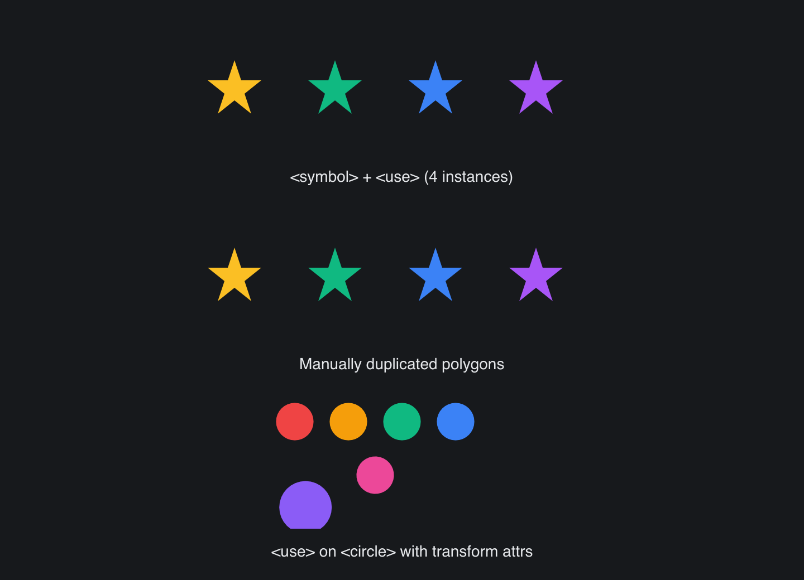

# SVG Use Symbol

> **Framework:** svg **Description:** <use> and <symbol> resolution with
> per-instance fill overrides. Compares desugaring to duplication.



<!-- explorer: tags=svg category=svg run=go -->

---

# svg_use_symbol

Demonstrates SVG `<use href="#id">` and `<symbol>` resolution.

A `<symbol id="star">` block is defined once in `<defs>`. Four `<use>`
references render the symbol at different positions, each with a per-instance
`fill` override. The example renders the result side by side with a manually
duplicated equivalent. Any geometric or color delta is immediately visible.

A second sample shows `<use>` that references a single `<circle>` element,
including per-instance `transform="scale(...)"` and `transform="rotate(...)"`
overrides on the use sites.

Run:

```
go run ./examples/svg_use_symbol/
```
