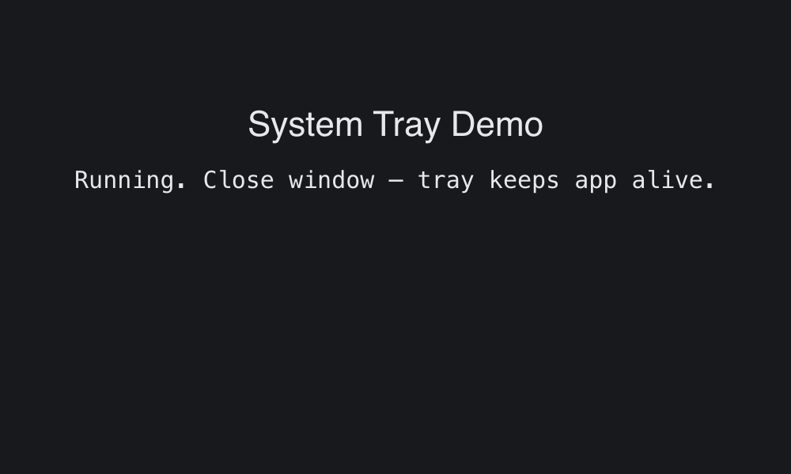

# System Tray

> **Framework:** system, platform **Description:** Tray icon with menu, re-show,
> and quit. Closing the window keeps the app alive via tray.



<!-- explorer: tags=system,platform category=system run=go -->

---

## Run

```sh
go run ./examples/system_tray/
```

## What it demonstrates

Tray icon with menu, re-show, and quit. Closing the window keeps the app alive
via tray.

See `main.go` for the implementation.
