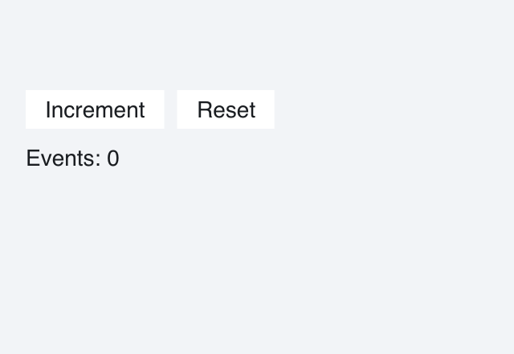

# Time Travel

> **Framework:** system **Description:** Time-travel debugging with a counter
> and scrubber window. Slider, steps, and keyboard shortcuts.



<!-- explorer: tags=system category=system run=go -->

---

## Run

```sh
go run ./examples/time_travel/
```

## What it demonstrates

Time-travel debugging with a counter and scrubber window. Slider, steps, and
keyboard shortcuts.

See `main.go` for the implementation.
