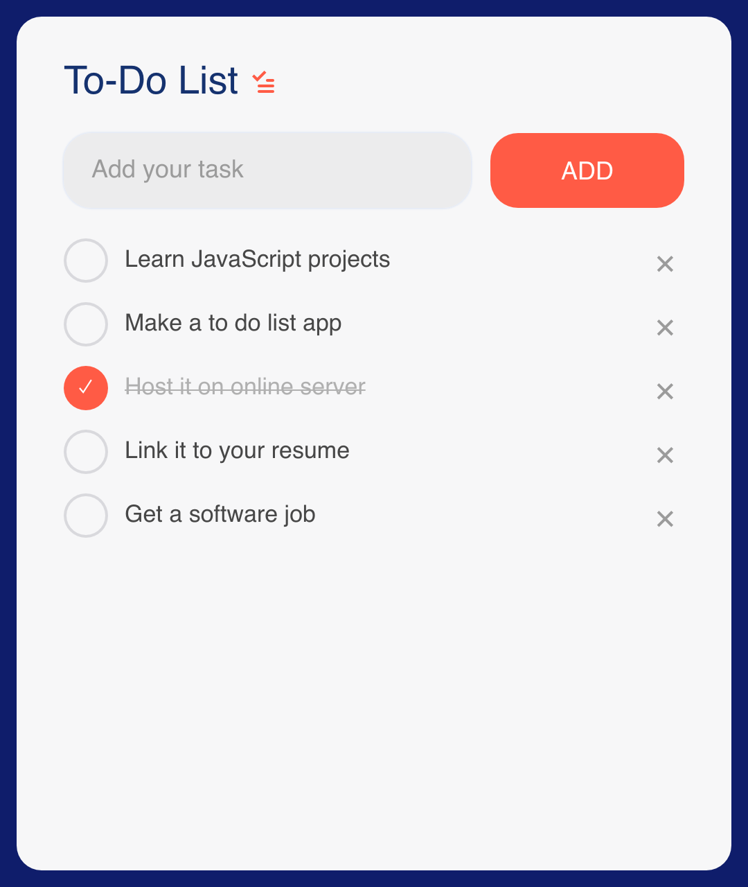

# Todo

> **Framework:** input, data **Description:** Small stateful app with input,
> buttons, and a list. Tasks are held in window state.



<!-- explorer: tags=input,data category=input run=go -->

---

## Run

```sh
go run ./examples/todo/
```

## What it demonstrates

Small stateful app with input, buttons, and a list. Tasks are held in window
state.

See `main.go` for the implementation.
