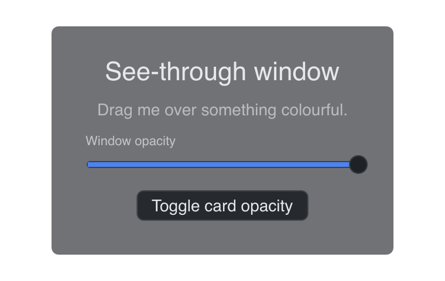

# Transparent

> **Framework:** system, platform **Description:** A see-through window via
> WindowCfg.Transparent, plus a whole-window fade via SetWindowOpacity.



<!-- explorer: tags=system,platform category=system run=go -->

---

## Run

```sh
go run ./examples/transparent/
```

## What it demonstrates

`WindowCfg.Transparent` lets the window's alpha channel reach the compositor, so
the desktop behind shows through wherever the content is not opaque. The card in
the middle is the only opaque thing in the window; the button changes its alpha,
which shows that the window itself is see-through and not only its edges.

`Transparent` on its own is enough. An unset `BgColor` on a transparent window
is treated as fully clear instead of taking the opaque theme background.

The slider drives `Window.SetWindowOpacity`, which is a different mechanism: the
compositor fades everything the window draws, so the card dims too. Per-pixel
transparency cannot do that, however low the card's own alpha goes. The two
compose — set both and the card is faded see-through.

This is plain transparency, with no blur. For the blurred macOS backdrop, see
`examples/vibrancy/` and `Window.SetWindowVibrancy`.

## Platform notes

| Platform          | Transparency                                          | Fade                                         |
| ----------------- | ----------------------------------------------------- | -------------------------------------------- |
| macOS             | Non-opaque `NSWindow` and `CAMetalLayer`              | `NSWindow.alphaValue`                        |
| Windows           | `DwmEnableBlurBehindWindow` with an empty blur region | `WS_EX_LAYERED`, not on a transparent window |
| X11               | Depth-32 ARGB visual; needs a compositing manager     | `_NET_WM_WINDOW_OPACITY`                     |
| web, iOS, Android | Ignored                                               | Ignored                                      |

On X11 with no compositing manager running, the window renders black.
`gui.Debug(true)` reports that, and also reports a driver that offered no
depth-32 visual.

On Windows the two features do not compose: the fade needs `WS_EX_LAYERED`,
which the transparency path deliberately avoids. This example is a transparent
window, so the slider is refused there and `gui.Debug(true)` says why. See
`docs/specs/window-opacity.md`.

See `main.go` for the implementation.
