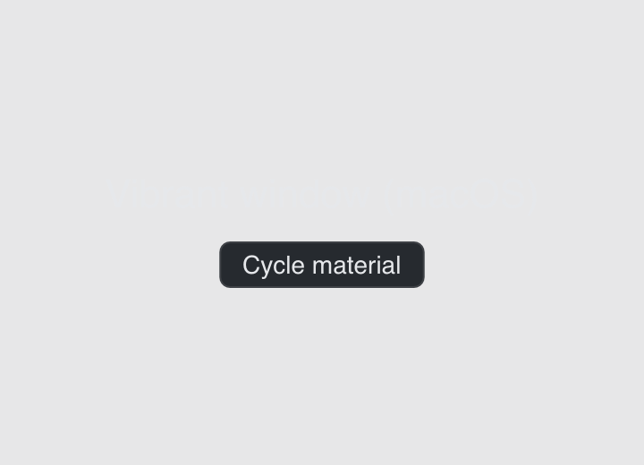

# Vibrancy

> **Framework:** system, platform **Description:** Translucent blurred backdrop
> on macOS via SetWindowVibrancy. Falls back to normal on other platforms.



<!-- explorer: tags=system,platform category=system run=go -->

---

## Run

```sh
go run ./examples/vibrancy/
```

## What it demonstrates

Translucent blurred backdrop on macOS via SetWindowVibrancy. Falls back to
normal on other platforms.

See `main.go` for the implementation.
