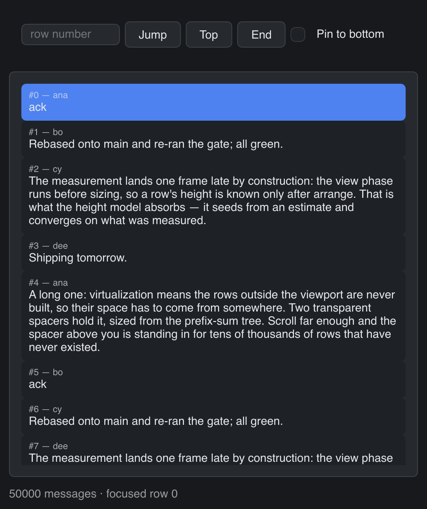

# Virtual List

> **Framework:** data, performance, layout **Description:** Virtualized list of
> 50,000 variable-height message cards. Rows measure on demand and recycle.



<!-- explorer: tags=data,performance,layout category=data run=go -->

---

# virtual_list

A virtualized message feed of 50,000 cards whose rows differ in height. Row
height derives from the wrapped body text. Nothing — not the app, not the widget
— knows a row's height until the layout engine measures it.

## Run

```
go run ./examples/virtual_list
```

## What it demonstrates

- **Variable row heights.** `VirtualList` builds only the rows near the
  viewport. It holds the rest of the space in two transparent spacers, sized
  from a prefix-sum tree that converges on measured heights. The existing
  virtualized widgets (`ListBox`, `Table`, `Tree`) divide by one scalar row
  height instead. That is exact for the rows they own and useless for rows the
  caller builds.
- **Index-addressed scrolling.** The Jump box calls
  `Window.ScrollToIndexAt(id, n, 0.5)`. The target row does not exist yet, so
  there is no ID to resolve and no view to find — `scrollToView` structurally
  cannot reach it.
- **Pin to bottom.** A background goroutine appends a message every second. With
  the toggle on, `Window.ScrollToEnd` re-pins after each append.
  `ScrollVerticalToPct(id, 1)` is the wrong tool: under virtualization the app
  assembles the content height from spacers over estimated rows, so a percentage
  drifts.
- **`ItemKey`.** The store keys heights, so a measured height follows its
  message when the app inserts others above it.

## Things worth copying

- Row IDs are composed with `gui.ScopeIDN(listID, "row", i)`, never by hand —
  `make ergonomics-audit` (mode `ids`) fails a literal `:`.
- The body text takes the `width` argument `ItemView` receives. That is the
  inner width the list recorded during the previous frame's arrange, which is
  what makes the measured height meaningful.
- Spacing between rows lives _inside_ the row. The list's own spacing is fixed
  at zero, because a gap between rows is height the model does not account for.
