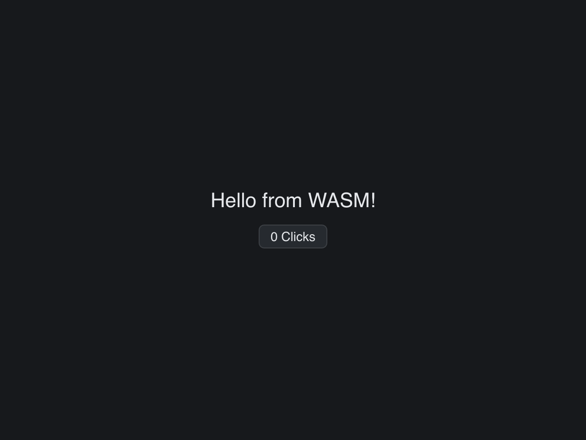

# Web Demo

> **Framework:** platform **Description:** Go-gui app running in the browser via
> WASM. Same source as get_started, compiled to wasm.



<!-- explorer: tags=platform category=platform run=mobile -->

---

## Run

```sh
go run ./examples/web_demo/
```

## What it demonstrates

Go-gui app running in the browser via WASM. Same source as get_started, compiled
to wasm.

See `main.go` for the implementation.
